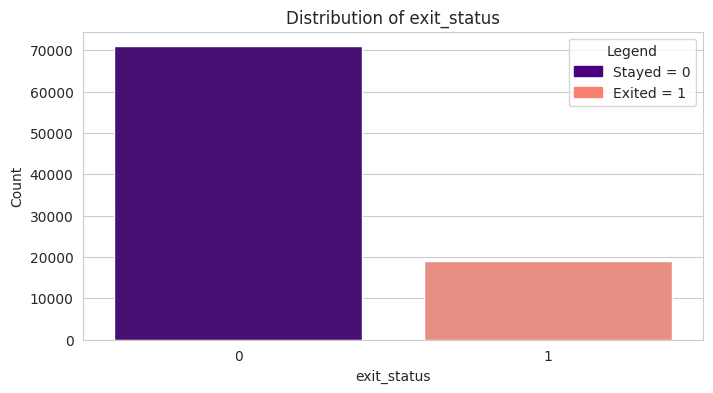
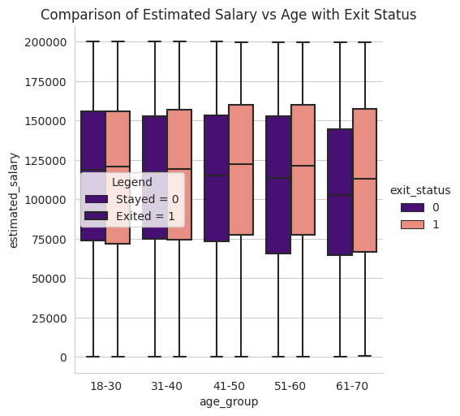
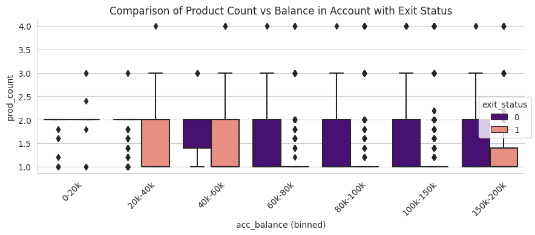

# Customer Churn Prediction using Machine Learning

## Overview

This project analyzes customer churn data from a financial institution and builds machine learning models to predict whether a customer is likely to leave the organization. The workflow covers data preprocessing, exploratory data analysis, feature engineering, model training, hyperparameter tuning, and model evaluation.

The objective is to identify patterns associated with customer attrition and develop predictive models that can support customer retention strategies.

---

## Dataset

The dataset contains customer demographic, financial, and behavioral information.

### Features

| Feature          | Description                              |
| ---------------- | ---------------------------------------- |
| customer_id      | Unique customer identifier               |
| last_name        | Customer surname                         |
| credit_score     | Customer credit score                    |
| country          | Country of residence                     |
| gender           | Customer gender                          |
| age              | Customer age                             |
| tenure           | Years associated with the institution    |
| acc_balance      | Account balance                          |
| prod_count       | Number of products used                  |
| has_card         | Credit card ownership indicator          |
| is_active        | Recent activity indicator                |
| estimated_salary | Estimated annual salary                  |
| exit_status      | Target variable (0 = Stayed, 1 = Exited) |

---

## Project Workflow

### 1. Data Understanding

* Identified numerical and categorical features.
* Examined dataset structure using `.info()` and `.describe()`.
* Generated descriptive statistics including mean, median, standard deviation, minimum, and maximum values.

### 2. Missing Value Handling

Missing values were identified in:

* credit_score
* country
* acc_balance
* prod_count

Imputation methods used:

| Column Type          | Method                         |
| -------------------- | ------------------------------ |
| Numerical Features   | KNN Imputation                 |
| Categorical Features | Most Frequent Value Imputation |

### 3. Duplicate Detection

Dataset was checked for duplicate records.

| Dataset | Duplicate Records |
| ------- | ----------------- |
| Train   | 0                 |
| Test    | 0                 |

### 4. Outlier Analysis

Outliers were identified using the IQR method.

| Feature       | Outliers Found |
| ------------- | -------------- |
| Credit Score  | 326            |
| Age           | 3411           |
| Product Count | 263            |

Outliers were retained because they represented valid customer behavior and removing them could result in information loss.

### 5. Feature Engineering

The preprocessing pipeline included:

* Standard Scaling for numerical features
* One-Hot Encoding for categorical features
* Missing value indicator creation
* Variance Threshold feature selection

---

## Exploratory Data Analysis

### Customer Churn Distribution



#### Insight

* Most customers remained with the institution.
* The dataset is moderately imbalanced.
* Evaluation metrics beyond accuracy are necessary to assess model performance effectively.

---

### Estimated Salary vs Exit Status Across Age Groups



#### Insight

* Salary alone does not appear to strongly influence churn.
* Customer age may have a greater impact on exit behavior.
* Churn patterns likely depend on interactions among multiple features.

---

### Product Count vs Account Balance by Exit Status



#### Insight

* Customers with fewer products tend to exhibit higher churn risk.
* High account balances do not guarantee customer retention.
* Product engagement appears to be an important retention factor.

---

## Models Trained

Seven machine learning algorithms were trained and evaluated:

1. Logistic Regression
2. Perceptron
3. K-Nearest Neighbors (KNN)
4. Decision Tree
5. Random Forest
6. Gradient Boosting
7. AdaBoost

---

## Hyperparameter Tuning

GridSearchCV was applied to:

* Logistic Regression
* Random Forest
* K-Nearest Neighbors

The goal was to identify parameter combinations that improved validation performance.

---

## Model Performance

| Model               | Accuracy | F1 Score |
| ------------------- | -------- | -------- |
| Gradient Boosting   | 0.861    | 0.609    |
| AdaBoost            | 0.858    | 0.601    |
| Random Forest       | 0.855    | 0.599    |
| KNN                 | 0.841    | 0.574    |
| Decision Tree       | 0.790    | 0.511    |
| Logistic Regression | 0.831    | 0.481    |
| Perceptron          | 0.719    | 0.418    |

### Key Findings

* Gradient Boosting achieved the highest F1 Score.
* Ensemble methods consistently outperformed simpler models.
* Gradient Boosting provided the best balance between precision and recall.
* Perceptron showed the weakest overall performance.

---

## Final Model

The final selected model was:

**Gradient Boosting Classifier**

Performance:

* Accuracy: 86.07%
* Precision: 74.42%
* Recall: 51.57%
* F1 Score: 60.92%
* ROC-AUC: 0.878

The model was used to generate predictions on the test dataset and create the final Kaggle submission file.

---

## Technologies Used

* Python
* Pandas
* NumPy
* Matplotlib
* Seaborn
* Scikit-learn

---

## Repository Structure

## Repository Structure

```text
.
├── customer-churn-prediction.ipynb
├── images/
│   ├── churn_distribution.png
│   ├── salary_age_exit.png
│   └── product_balance_exit.png
└── README.md
```

---

## Conclusion

This project demonstrates a complete machine learning workflow for customer churn prediction, including data cleaning, exploratory analysis, preprocessing, model comparison, hyperparameter tuning, and evaluation. Among the models tested, Gradient Boosting delivered the strongest overall performance and was selected as the final model for generating predictions.
